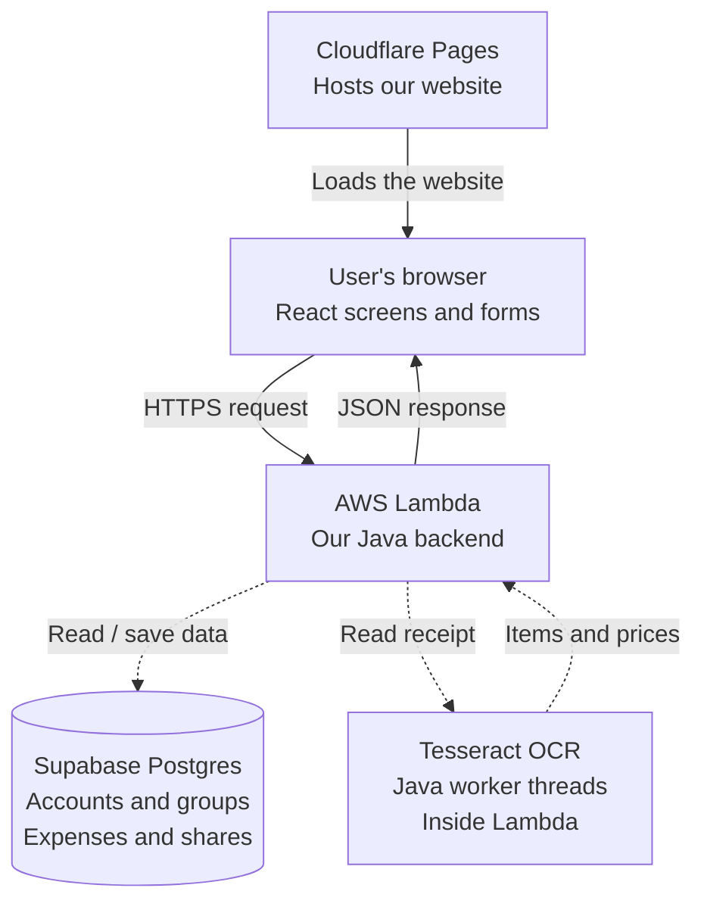
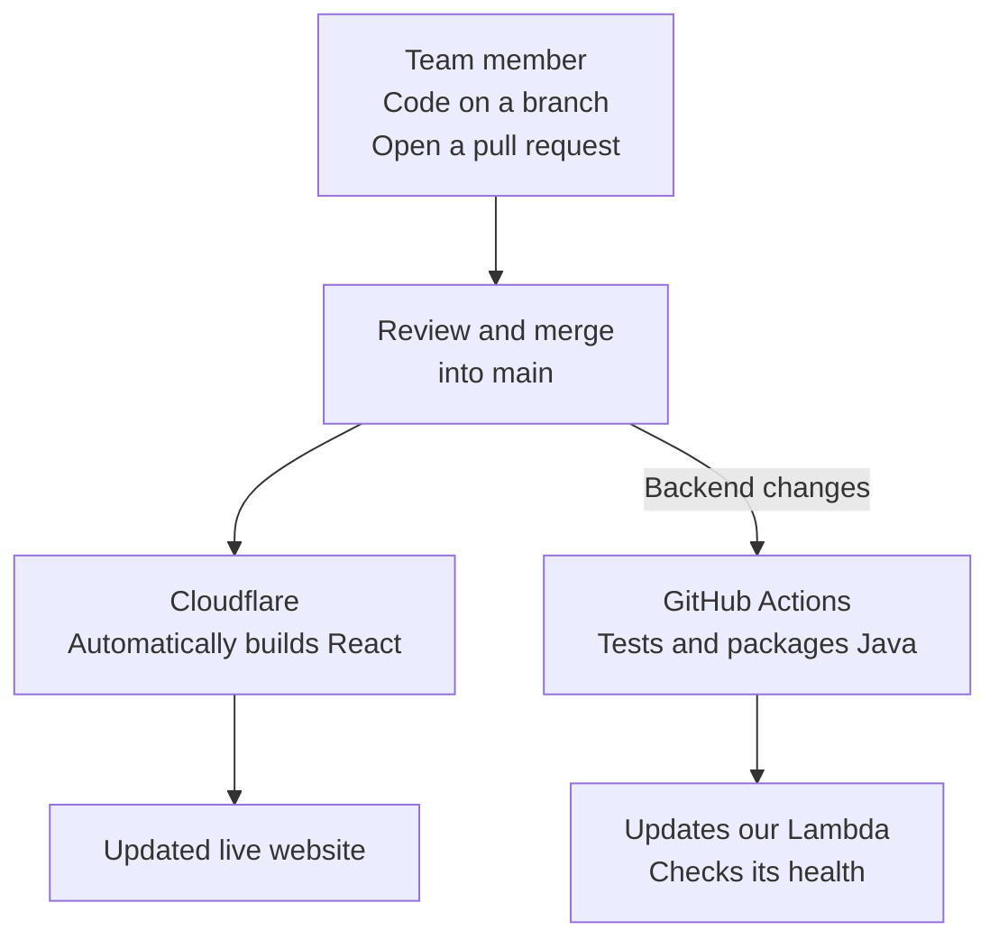

# CSCI 201 Team 3: group expense tracker

React frontend, Java 21 AWS Lambda backend, and Supabase Postgres.
This repository is a starter, not the completed course project.
There is no Spring Boot dependency.

- [Live starter](https://csci201-expense-tracker.pages.dev)
- [Java health endpoint](https://sautin26evkxdm33hseqsah6te0kjgua.lambda-url.us-west-2.on.aws/health)
- [Build and deployment runs](https://github.com/acesava/CSCI201-Team3/actions)

## How our app works

Cloudflare delivers the React website to the user's browser.
React sends requests to Java and displays the results Java sends back.



**Working now:** the website and Java health check.
**Still to build:** Java login, permissions, expense splitting, database integration, and receipt reading.
Dashed arrows show planned connections.
Users will also be able to enter expenses manually without uploading a receipt.

## How our changes go live



No manual deployment button is needed for normal frontend or backend changes merged into `main`.
The separate **Build and test** workflow checks pull requests before merging.
Supabase database changes are not automatically deployed yet.

## Start locally

Install Node.js 22 and a JDK 21.
Maven is downloaded automatically by the checked-in wrapper.

```sh
cd frontend
npm ci
npm run dev
```

In another terminal, test and package Java:

```sh
cd backend
./mvnw verify
# Windows: .\mvnw.cmd verify
```

The deployment artifact is `backend/target/expense-api.jar`.
The Lambda handler is `edu.usc.csci201.team3.Handler::handleRequest`.
`GET /health` is the only implemented route.
All other routes return 404, and non-GET requests to `/health` return 405.

Copy `frontend/.env.example` to `frontend/.env.local` and set `VITE_API_BASE_URL` when the Lambda URL exists.
Restart Vite after changing this value.
The page's connection check uses a real HTTP request; without a configured URL it reports that setup is incomplete.

## Folder responsibilities

| Folder | What belongs here |
| --- | --- |
| `frontend/` | React screens, forms, charts, and calls to Java |
| `backend/` | Java login, permissions, groups, expenses, and splitting logic |
| `database/` | Reviewed SQL migrations and database notes |
| `infrastructure/` | Cloud setup and deployment instructions |
| `.github/workflows/` | Build checks and Java deployment |

See [cloud setup](infrastructure/SETUP.md) for exact service settings and remaining owner actions.

## Work together

Use a feature branch and a pull request for each change.
The build checks compile React and run the Java tests.
After the cloud connection is configured, pushes to `main` update production.
Do not commit passwords, AWS access keys, session tokens, receipt photos, or Supabase service-role keys.
The repository is public; teammates still need collaborator invitations to push changes.

## Next implementation milestones

- Register/login/logout in Java, password hashing, expiring sessions, and guest sample data.
- Create groups and check membership on every private operation.
- Manual expense entry with a payer, participants, and integer-cent splits.
- Store each expense and its shares in a transaction, then show balances.
- Add editable receipt extraction only after the manual path works.
- Demonstrate explicit Java concurrency with bounded receipt tasks and collect all results before a Lambda invocation returns.

Tesseract, user authentication, database access, and multithreading are not implemented in this starter.
Concurrent Lambda invocations alone are not the planned Java multithreading demonstration.
